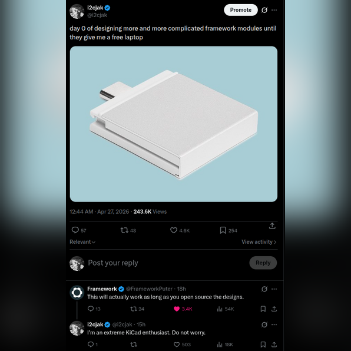
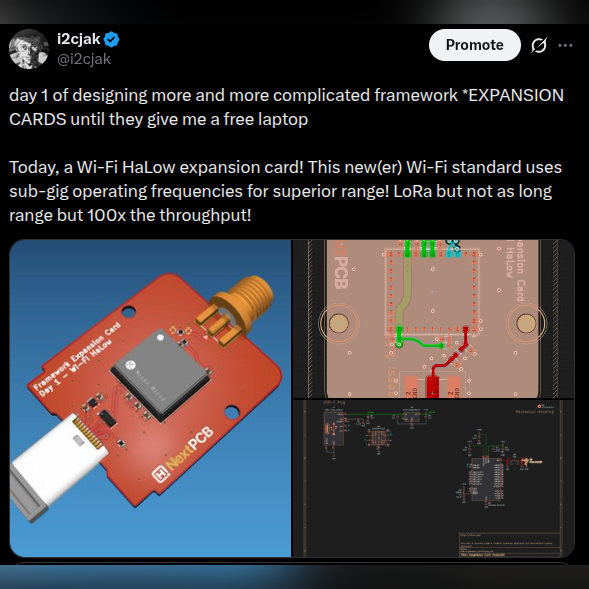
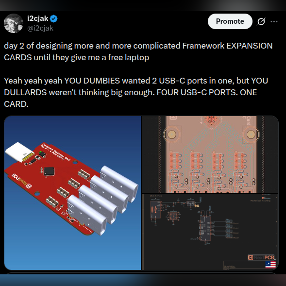
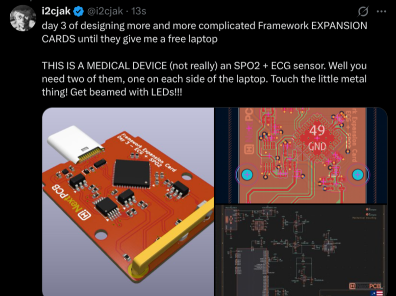
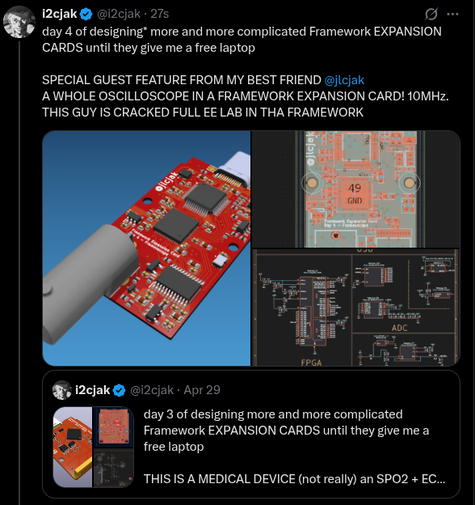

# i2cjak on X.com is THE foremost hardware engineer and poaster. he is designing one (1) new Framework Expansion Card per day until they give him a REALLY NICE laptop

# PROOF OF CHALLENGE!

  

## [Day 1](./Day_01_Wi-Fi-HaLow/)

Wi-Fi HaLow

  

## [Day 2](./Day_02_Four_Port_USB_C/)

Four Port USB-C

  

## [Day 3](./Day_03_ECG_SPO2/)

Electrocardiogram + SPO2

  

## [Day 4](./Day_04_Frameoscope/)

Frameoscope

  

